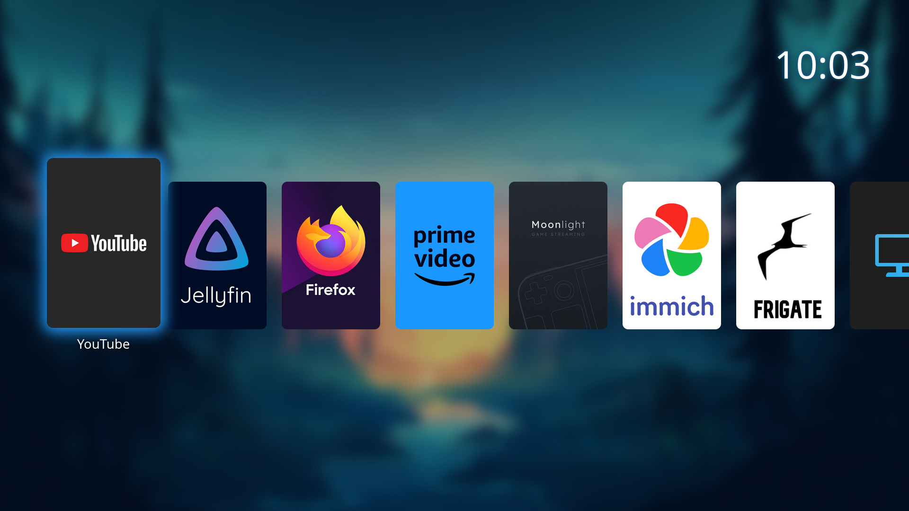

# WebTV Launcher



WebTV Launcher is a simple TV-style web and native app launcher for Linux, designed for use with a remote or keyboard. It provides a beautiful, TV-friendly interface to launch web apps in Firefox or native apps with media controls.

## Features

- TV-style carousel interface for easy navigation
- Launch web apps in Firefox
- Launch native apps (e.g., Moonlight)
- Media controls (play/pause, next, previous) for Firefox
- Customizable app list via `apps.json`

## Installation

Run the installation script:

```bash
curl -L https://raw.githubusercontent.com/rikman122/webtv/main/install.sh | sh
```

The script will:
- Install required packages (Firefox, playerctl, Python, Flask)
- Create a dedicated Firefox profile with custom settings for WebTV
- Install recommended Firefox extensions (uBlock Origin, SponsorBlock)
- Set up the homepage to WebTV
- Optionally add WebTV to autostart

## Customization

- Edit `apps.json` to add, remove, or modify apps shown in the launcher.
- Place your own icons in `static/icons/` and background in `static/images/`.


## Media Control API

You can control media playback in Firefox and query its status using the following HTTP endpoints:

### Control Media Playback

Send a POST request to `/media_control` with a JSON body:

```bash
curl -X POST -H "Content-Type: application/json" -d '{"command": "playpause"}' http://localhost:8000/media_control
```

Valid commands are:
- `playpause`
- `next`
- `prev`

### Query Media Status

Send a GET request to `/media_status`:

```bash
curl http://localhost:8000/media_status
```

Response will be JSON, e.g.:

```json
{"status": "Playing"}
```
### Home Assistant Integration

Using both endpoints it's easy to integrate media control with Home Assistant. Check REST commands under `automations` folder. I've also included an automation I'm running to pause/resume media player whenever I'm talking to the Home Assistant voice assistant on my living room.

## Volume OSD Mod

**Warning:** The OSD Mod was only tested on Debian KDE5. Compatibility with other distributions or Plasma versions is not guaranteed.

This will change the style and position of the OSD Volume bar to be at a less disturbing position at the top left corner. Place content from the plasma folder into:


`/usr/share/plasma/look-and-feel/org.kde.breeze.desktop/contents/osd/`

## Credits

- [Steamgriddb](https://www.steamgriddb.com/) community for the grid images
- [@ClassicOldSong](https://gist.github.com/ClassicOldSong) for the Firefox Profile inspiration
- [@mklgustafsson](https://www.instagram.com/mklgustafsson) for his amazing background picture

## License

WebTV Launcher is released under the GNU GENERAL PUBLIC LICENSE. See the LICENSE file for details.

